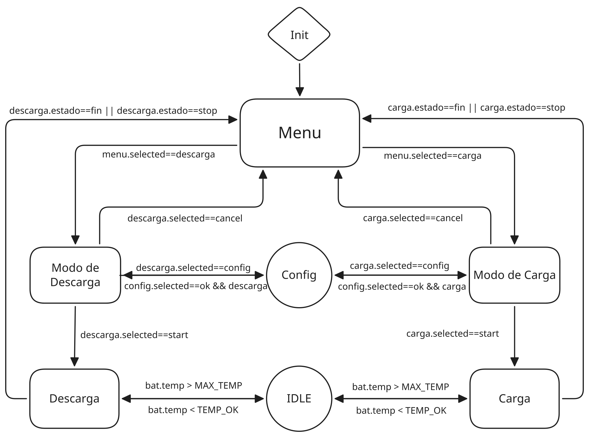

# Cargador Universal de Baterias

El proyecto para el trabajo práctico integrador es un cargador universal de baterias, que como su nombre lo indica, es capaz de cargar una amplia variedad de baterias. 
Para poder acomodar el funcionamiento a una gran cantidad de posibles configuraciones, tanto la tensión como la corriente de carga se pueden elegir según cada batería. 
Distintos compuestos quimicos requieren de diferentes procedimientos de carga, la idea es permitir cargar baterías fabricadas con los siguientes compuestos: 
Li-ion, LiPo, LiFePO4, SLA, AGM, Gel, NiMH, NiCd.

Para implementar este proyecto se usará un microcontrolador ESP32, acompañado de un sensor de corriente y tensión INA219 ocupado de monitorear el estado de carga, un sensor de temperatura formado por el termistor en la bateria y una resistencia fija, una fuente buck controlada por PWM encargada de generar la tensión y corriente requerida en cada etapa y un circuito conmutado de potencia para la descarga controlada de la batería. Para mostrar la información al usuario, se dispondrá de una pantalla OLED.

Aquí se muestra un diagrama de bloques de la FSM que controlará el proyecto.

